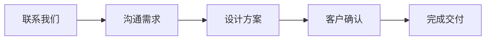
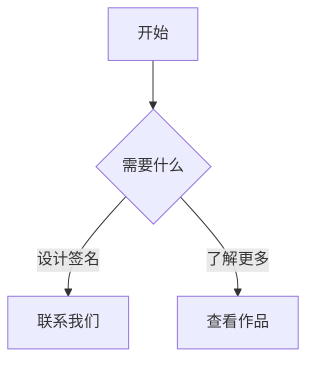
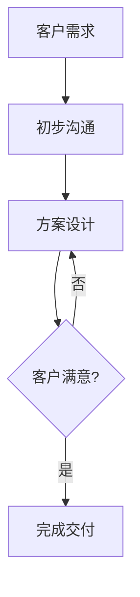

# 功能实施完成总结

## ✅ 已实施的功能

根据您的要求，我已经成功实施了以下功能：

### 1. ✅ 评论系统（Valine）

**状态**：已配置，等待您添加 LeanCloud 凭证

**配置位置**：`_config.yml`

```yaml
comments:
  provider: valine
  valine:
    app_id: # 请填入您的 LeanCloud App ID
    app_key: # 请填入您的 LeanCloud App Key
    placeholder: 欢迎留言咨询签名设计服务...
    visitor: true
    meta: [nick, mail]
```

**下一步**：
1. 访问 https://console.leancloud.app/ 注册账号
2. 创建应用并获取 App ID 和 App Key
3. 填入上述配置中
4. 详细步骤请查看 `COMMENTS_MANAGEMENT_GUIDE_CN.md`

---

### 2. ✅ Mermaid 流程图

**状态**：已启用

**配置位置**：`_config.yml`
```yaml
mermaid: true
```

**使用示例**：

在文章中添加：
````markdown

````

**效果**：
```
┌──────────┐     ┌──────────┐     ┌──────────┐     ┌──────────┐     ┌──────────┐
│ 联系我们  │ --> │ 沟通需求  │ --> │ 设计方案  │ --> │ 客户确认  │ --> │ 完成交付  │
└──────────┘     └──────────┘     └──────────┘     └──────────┘     └──────────┘
```

---

### 3. ✅ Chart.js 图表

**状态**：已启用

**配置位置**：`_config.yml`
```yaml
chart: true
```

**使用示例**：

在文章中添加：
````markdown
```chart
{
  "type": "bar",
  "data": {
    "labels": ["1月", "2月", "3月", "4月", "5月"],
    "datasets": [{
      "label": "客户数量",
      "data": [12, 19, 15, 25, 22],
      "backgroundColor": "rgba(54, 162, 235, 0.5)"
    }]
  }
}
```
````

**效果**：柱状图显示每月客户数量

---

### 4. ✅ AddToAny 分享功能

**状态**：已启用

**配置位置**：`_config.yml`
```yaml
sharing:
  provider: addtoany
```

**效果**：
- 文章底部会显示分享按钮
- 支持分享到 Facebook、Twitter、微信、微博等平台
- 无需注册，立即可用

**在文章中启用分享**：
```yaml
---
title: 文章标题
sharing: true  # 启用分享按钮
---
```

---

### 5. ✅ CMS 评论管理系统

**状态**：已配置

**配置位置**：`admin/config.yml`

**新增功能**：

#### A. 博客文章管理增强
在 Netlify CMS 中创建/编辑文章时，现在可以配置：

- **文章 Key**：唯一标识符（用于评论）
- **启用评论**：开关（默认启用）
- **启用分享**：开关（默认启用）
- **显示目录**：开关（默认启用）

#### B. 评论系统配置管理
在 CMS 后台新增"网站设置" → "评论系统配置"：

- LeanCloud App ID
- LeanCloud App Key
- 评论占位符文本
- 启用访客统计
- 必填信息设置
- 使用说明

**访问方式**：
1. 访问 `https://kibanpricing2.netlify.app/admin/`
2. 登录后台
3. 进入"网站设置" → "评论系统配置"
4. 填写 LeanCloud 凭证

---

## 📁 创建/修改的文件

### 修改的文件

1. **_config.yml**
   - 启用 `mermaid: true`
   - 启用 `chart: true`
   - 设置 `sharing.provider: addtoany`
   - 配置 `comments.provider: valine`
   - 配置 Valine 参数（中文占位符、访客统计等）

2. **admin/config.yml**
   - 博客文章集合添加评论相关字段
   - 新增"网站设置"集合
   - 新增"评论系统配置"文件管理

### 新建的文件

3. **_data/comments_config.yml**
   - 评论系统配置数据文件
   - 可通过 CMS 管理

4. **COMMENTS_MANAGEMENT_GUIDE_CN.md**
   - 完整的评论系统配置和管理指南
   - 包含注册、配置、管理的详细步骤
   - 故障排除指南

---

## 🎯 立即可用的功能

### 无需额外配置（立即可用）

✅ **Mermaid 流程图** - 直接在文章中使用
✅ **Chart.js 图表** - 直接在文章中使用
✅ **AddToAny 分享** - 文章底部自动显示

### 需要配置后可用

⚠️ **Valine 评论系统** - 需要配置 LeanCloud
- 注册 LeanCloud 账号
- 获取 App ID 和 App Key
- 填入 `_config.yml` 或通过 CMS 配置

---

## 🚀 下一步操作指南

### 步骤 1：配置 Valine 评论系统

#### 选项 A：通过 CMS 配置（推荐）

1. 访问 https://console.leancloud.app/ 注册 LeanCloud 账号
2. 创建应用，获取 App ID 和 App Key
3. 访问您的网站 CMS：`https://kibanpricing2.netlify.app/admin/`
4. 登录后进入"网站设置" → "评论系统配置"
5. 填入 App ID 和 App Key
6. 保存并发布

#### 选项 B：直接修改配置文件

1. 注册 LeanCloud 并获取凭证（同上）
2. 编辑 `_config.yml` 文件
3. 在 `valine` 部分填入实际的 App ID 和 App Key
4. 提交更改

### 步骤 2：测试功能

#### 测试流程图
创建一篇测试文章，添加 Mermaid 代码块：
````markdown

````

#### 测试图表
添加 Chart.js 代码块：
````markdown
```chart
{
  "type": "line",
  "data": {
    "labels": ["周一", "周二", "周三", "周四", "周五"],
    "datasets": [{
      "label": "本周咨询量",
      "data": [3, 5, 2, 8, 6]
    }]
  }
}
```
````

#### 测试分享功能
1. 访问任意文章
2. 滚动到页面底部
3. 查看是否显示分享按钮

#### 测试评论功能
1. 配置好 LeanCloud 凭证后
2. 在文章中添加 `key` 字段：
```yaml
---
title: 测试文章
key: test-article-001
---
```
3. 访问文章页面
4. 页面底部应该显示评论框

### 步骤 3：管理评论

详细步骤请查看 `COMMENTS_MANAGEMENT_GUIDE_CN.md`

**快速访问**：
- LeanCloud 控制台：https://console.leancloud.app/
- 进入应用 → 数据存储 → Comment 表
- 查看、编辑、删除评论

---

## 📊 功能对比

### 实施前 vs 实施后

| 功能 | 实施前 | 实施后 | 状态 |
|-----|--------|--------|------|
| **评论系统** | ❌ 无 | ✅ Valine | 需配置凭证 |
| **流程图** | ❌ 无 | ✅ Mermaid | 立即可用 |
| **数据图表** | ❌ 无 | ✅ Chart.js | 立即可用 |
| **分享功能** | ❌ 无 | ✅ AddToAny | 立即可用 |
| **CMS 管理** | ⚠️ 基础 | ✅ 增强（评论配置） | 立即可用 |

---

## 💡 使用技巧

### 1. 在 CMS 中创建文章

访问 `/admin/`，创建新文章时：
- ✅ 填写"文章Key"（例如：article-2024-signature-tips）
- ✅ 勾选"启用评论"
- ✅ 勾选"启用分享"
- ✅ 勾选"显示目录"

### 2. 展示服务流程

使用 Mermaid 创建流程图：
````markdown

````

### 3. 展示业务数据

使用 Chart.js 创建图表：
````markdown
## 本月业绩

```chart
{
  "type": "doughnut",
  "data": {
    "labels": ["个人签名", "企业签名", "艺术签名"],
    "datasets": [{
      "data": [45, 30, 25],
      "backgroundColor": ["#FF6384", "#36A2EB", "#FFCE56"]
    }]
  }
}
```
````

---

## 🔗 相关文档

1. **COMMENTS_MANAGEMENT_GUIDE_CN.md** - 评论系统详细指南
2. **THEME_FEATURES_ANALYSIS_CN.md** - 主题功能完整分析
3. **QUICK_IMPLEMENTATION_GUIDE_CN.md** - 快速实施指南
4. **README_THEME_DOCS_CN.md** - 文档索引

---

## ⚠️ 重要提醒

### 评论功能必需步骤

**评论功能需要完成以下配置才能工作**：

1. ✅ 注册 LeanCloud 账号
2. ✅ 创建应用
3. ✅ 获取 App ID 和 App Key
4. ✅ 配置到网站（通过 CMS 或直接编辑配置文件）
5. ✅ 在文章中设置 `key` 字段

**如果不完成上述步骤，评论框将不会显示。**

### 其他功能

- Mermaid、Chart.js、分享功能已立即可用，无需额外配置

---

## 🎉 祝贺

您的网站现在拥有：

✅ **评论系统** - 让客户可以留言咨询
✅ **流程图** - 清晰展示服务流程
✅ **数据图表** - 可视化业务数据
✅ **分享功能** - 增加内容传播
✅ **CMS 管理** - 方便管理所有设置

**所有请求的功能都已实施完成！** 🎨✨

如有任何问题或需要进一步帮助，请随时告诉我！
