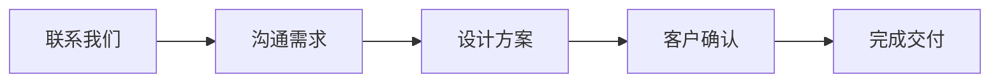

# Jekyll TeXt 主题功能快速实施指南

本指南提供了可以立即实施的功能配置代码，您只需复制粘贴并修改相关参数即可。

---

## 1. 启用评论功能（推荐：Valine）

### 步骤 1：注册 LeanCloud
1. 访问 [LeanCloud 国际版](https://console.leancloud.app/) 或 [LeanCloud 中国版](https://console.leancloud.cn/)
2. 注册账号并创建应用
3. 在应用设置中找到 `App ID` 和 `App Key`

### 步骤 2：修改 _config.yml
```yaml
# 找到 comments 部分，修改为：
comments:
  provider: valine
  valine:
    app_id: "你的-leancloud-app-id"      # 替换为您的 App ID
    app_key: "你的-leancloud-app-key"    # 替换为您的 App Key
    placeholder: "欢迎留言咨询..."        # 评论框提示文字
    visitor: true                         # 启用访客统计
```

### 步骤 3：在文章中启用评论
文章需要添加 `key` 字段才能显示评论：
```yaml
---
title: 您的文章标题
key: unique-article-key  # 每篇文章使用唯一的 key
---
```

---

## 2. 启用分享功能（推荐：AddToAny）

### 修改 _config.yml
```yaml
# 找到 sharing 部分，修改为：
sharing:
  provider: addtoany  # 从 false 改为 addtoany
```

### 在文章中启用分享
```yaml
---
title: 您的文章标题
sharing: true  # 启用分享按钮
---
```

---

## 3. 添加 Google Analytics

### 步骤 1：获取 Google Analytics 跟踪 ID
1. 访问 [Google Analytics](https://analytics.google.com/)
2. 创建账号和属性
3. 获取跟踪 ID（格式：UA-XXXXXXXXX-X 或 G-XXXXXXXXXX）

### 步骤 2：修改 _config.yml
```yaml
# 找到 analytics 部分，修改为：
analytics:
  provider: google
  google:
    tracking_id: "UA-XXXXXXXXX-X"  # 替换为您的跟踪 ID
    anonymize_ip: false
```

---

## 4. 添加更多社交媒体链接

### 修改 _config.yml
```yaml
# 找到 author 部分，添加您的社交媒体账号：
author:
  type: person
  name: Chiko-LIN
  url: https://kibanpricing2.netlify.app
  avatar: /assets/images/avatar.jpg  # 添加您的头像路径
  bio: 专业签名设计师，为您打造独特的个人签名
  email: your@email.com              # 修改为您的真实邮箱
  facebook: "your_facebook_username"  # 如有 Facebook
  twitter: "your_twitter_username"    # 如有 Twitter
  weibo: "your_weibo_id"             # 如有微博
  telegram: "your_telegram_username" # 如有 Telegram
  medium: "your_medium_username"     # 如有 Medium
  zhihu: "your_zhihu_username"       # 如有知乎
  linkedin: "your_linkedin_username" # 如有 LinkedIn
  github: Chiko-LIN                  # 已配置
```

---

## 5. 启用图表和流程图支持

### 修改 _config.yml
```yaml
# 找到 Markdown Enhancements 部分，修改为：
## Mermaid (流程图)
mermaid: true  # 从 false 改为 true

## Chart (数据图表)
chart: true    # 从 false 改为 true
```

### 使用示例：Mermaid 流程图
在文章中添加：
````markdown

````

### 使用示例：Chart.js 图表
在文章中添加：
````markdown
```chart
{
  "type": "bar",
  "data": {
    "labels": ["1月", "2月", "3月", "4月", "5月"],
    "datasets": [{
      "label": "客户数量",
      "data": [12, 19, 15, 25, 22],
      "backgroundColor": "rgba(54, 162, 235, 0.5)"
    }]
  }
}
```
````

---

## 6. 启用页面浏览量统计

### 步骤 1：使用同一个 LeanCloud 应用
（如果您已经为评论功能设置了 LeanCloud，可以使用同一个应用）

### 步骤 2：修改 _config.yml
```yaml
# 找到 pageview 部分，修改为：
pageview:
  provider: leancloud
  leancloud:
    app_id: "你的-leancloud-app-id"      # 与评论使用相同的 App ID
    app_key: "你的-leancloud-app-key"    # 与评论使用相同的 App Key
    app_class: "Counter"                 # LeanCloud 中的 Class 名称
```

### 步骤 3：在文章中启用
```yaml
---
title: 您的文章标题
key: unique-article-key  # 必须设置 key
pageview: true           # 启用浏览量统计
---
```

---

## 7. 改进文章视觉效果

### A. 添加文章封面图
```yaml
---
title: 您的文章标题
cover: /assets/images/your-cover-image.jpg  # 封面图片路径
---
```

### B. 使用沉浸式头部（Overlay 效果）
```yaml
---
title: 您的文章标题
article_header:
  type: overlay
  theme: dark
  background_color: '#203028'
  background_image:
    gradient: 'linear-gradient(135deg, rgba(34, 139, 87, .4), rgba(139, 34, 139, .4))'
    src: /assets/images/header-bg.jpg
---
```

### C. 使用封面样式头部
```yaml
---
title: 您的文章标题
article_header:
  type: cover
  image:
    src: /assets/images/cover.jpg
---
```

---

## 8. 使用附加样式

### 提示框样式
在 Markdown 文件中添加：

```markdown
这是成功提示信息。
{:.success}

这是普通信息提示。
{:.info}

这是警告信息。
{:.warning}

这是错误信息。
{:.error}
```

### 图片样式
```markdown
{:.border}           # 边框
{:.shadow}           # 阴影
{:.rounded}          # 圆角
{:.circle}           # 圆形
{:.border.shadow}    # 组合：边框+阴影
```

### 按钮样式
```markdown
[访问我的网站](https://kibanpricing2.netlify.app){:.button.button--primary.button--rounded.button--lg}
```

---

## 9. 嵌入视频

### YouTube 视频
在文章中添加：
```markdown
<div></div>
```
视频 ID 是 YouTube 链接中 `v=` 后面的部分，例如：
`https://www.youtube.com/watch?v=dQw4w9WgXcQ` 的 ID 是 `dQw4w9WgXcQ`

### bilibili 视频
```markdown
<div></div>
```
视频 ID 是 bilibili 链接中的数字部分，例如：
`https://www.bilibili.com/video/BV1xx411c7mD/` 的 ID 可以在页面 URL 或分享链接中找到

---

## 10. 创建专业着陆页

### 创建新页面文件（如 `services.html`）
```html
---
layout: landing
title: 我们的服务
excerpt: 专业的签名设计服务
article_header:
  type: overlay
  theme: dark
  background_color: '#203028'
  background_image:
    gradient: 'linear-gradient(135deg, rgba(34, 139, 87, .4), rgba(139, 34, 139, .4))'
    src: /assets/images/services-bg.jpg
  actions:
    - text: 立即咨询
      type: error
      url: /contact/
    - text: 查看作品
      type: outline-theme-dark
      url: /portfolio/
data:
  sections:
    - title: 为什么选择我们
      children:
        - title: 专业设计
          excerpt: 10年以上设计经验
        - title: 快速交付
          excerpt: 24小时内完成初稿
        - title: 满意保证
          excerpt: 不满意全额退款
---

<div class="layout--articles">
  <!-- 页面内容 -->
</div>
```

---

## 完整的 _config.yml 推荐配置

以下是建议您采用的完整配置（包含所有推荐功能）：

```yaml
# 在您当前的 _config.yml 中找到对应部分并修改

## => Markdown Enhancements
##############################
mathjax: false              # 如不需要数学公式，保持 false
mathjax_autoNumber: false

mermaid: true               # ✅ 启用流程图
chart: true                 # ✅ 启用数据图表

## => Sharing
##############################
sharing:
  provider: addtoany        # ✅ 启用分享功能

## => Comments
##############################
comments:
  provider: valine          # ✅ 启用评论（选择 valine、disqus 或 gitalk）
  
  ## Valine 配置
  valine:
    app_id: "你的-app-id"
    app_key: "你的-app-key"
    placeholder: "欢迎留言咨询签名设计服务..."
    visitor: true
    meta: "[nick, mail]"

## => Pageview
##############################
pageview:
  provider: leancloud       # ✅ 启用浏览量统计
  leancloud:
    app_id: "你的-app-id"
    app_key: "你的-app-key"
    app_class: "Counter"

## => Analytics
##############################
analytics:
  provider: google          # ✅ 启用 Google Analytics
  google:
    tracking_id: "你的-GA-ID"
    anonymize_ip: false

## => Author and Social
##############################
author:
  type: person
  name: Chiko-LIN
  url: https://kibanpricing2.netlify.app
  avatar: /assets/images/avatar.jpg  # ✅ 添加头像
  bio: 专业签名设计师，为您打造独特的个人签名
  email: contact@kibanpricing2.com   # ✅ 更新真实邮箱
  twitter: "your_twitter"            # ✅ 添加社交媒体
  linkedin: "your_linkedin"
  github: Chiko-LIN
```

---

## 测试功能

启用功能后，请进行以下测试：

1. **本地预览**
   ```bash
   bundle exec jekyll serve
   ```
   访问 `http://localhost:4000` 查看效果

2. **检查评论功能**
   - 打开任何设置了 `key` 的文章
   - 页面底部应该显示评论框

3. **检查分享按钮**
   - 打开任何设置了 `sharing: true` 的文章
   - 应该看到分享按钮

4. **检查 Google Analytics**
   - 部署网站后
   - 访问 Google Analytics 控制台
   - 查看是否接收到实时访客数据

5. **测试图表和流程图**
   - 创建一篇包含 mermaid 或 chart 代码块的测试文章
   - 检查是否正确渲染

---

## 故障排除

### 问题 1：评论不显示
**解决方案**：
- 确认文章 YAML 头部有 `key` 字段
- 检查 LeanCloud App ID 和 App Key 是否正确
- 清除浏览器缓存后重试

### 问题 2：分享按钮不显示
**解决方案**：
- 确认文章 YAML 头部设置了 `sharing: true`
- 检查 _config.yml 中 `sharing.provider` 不是 `false`

### 问题 3：Mermaid 或 Chart 不渲染
**解决方案**：
- 确认 _config.yml 中启用了 `mermaid: true` 或 `chart: true`
- 重启 Jekyll 服务器（配置文件修改需要重启）
- 检查代码块语法是否正确

### 问题 4：Google Analytics 没有数据
**解决方案**：
- 等待 24-48 小时，数据可能有延迟
- 确认跟踪 ID 格式正确
- 检查浏览器是否安装了广告拦截器

---

## 下一步

完成上述配置后，建议您：

1. ✅ **创建几篇展示性文章**
   - 使用不同的文章头部样式
   - 添加封面图片
   - 嵌入流程图和视频

2. ✅ **测试所有功能**
   - 在不同设备上预览
   - 测试评论和分享功能
   - 检查 Google Analytics 数据

3. ✅ **优化 SEO**
   - 确保每篇文章有描述（excerpt）
   - 添加相关标签（tags）
   - 使用有意义的 URL 结构

4. ✅ **收集用户反馈**
   - 通过评论功能了解用户需求
   - 根据 Analytics 数据优化内容

祝您的签名设计网站越来越好！🎨✨

如需进一步帮助，请随时联系！
