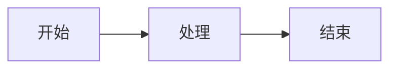

# Jekyll TeXt 主题功能分析报告

## 概述

本文档详细分析了 Jekyll TeXt 主题的所有功能，并与当前 Kibanpricing2 仓库的配置进行对比，帮助您了解可以添加到当前仓库的功能。

## 当前仓库状态

您的仓库已经是基于 Jekyll TeXt 主题构建的，并且已经配置了以下功能：

### ✅ 已启用的功能

1. **基础主题设置**
   - 主题皮肤：ocean
   - 高亮主题：default
   - 语言：英文（en）
   - 时区：Asia/Shanghai

2. **站点信息**
   - 标题：Kibanpricing
   - 描述：Professional signature design service
   - URL：https://kibanpricing2.netlify.app

3. **导航菜单**
   - Home（首页）
   - Pricing（价格）
   - Updates（更新/博客）
   - Contact Us（联系我们）
   - About Me（关于我）

4. **基础插件**
   - jekyll-feed（RSS 订阅）
   - jekyll-paginate（分页功能）
   - jekyll-sitemap（站点地图）
   - jemoji（表情符号支持）

5. **文章默认设置**
   - 布局：article
   - 分享功能：启用
   - 许可证显示：启用（CC-BY-NC-4.0）
   - 目录（TOC）：启用
   - 在 GitHub 上编辑：启用
   - 订阅按钮：启用
   - 页面浏览量统计：启用

### ❌ 未启用但可用的功能

## 可以添加的功能列表

### 1. 内容增强功能

#### 1.1 数学公式支持（MathJax）
**用途**：在文章中显示数学公式

**当前状态**：❌ 未启用

**如何启用**：
```yaml
# 在 _config.yml 中添加
mathjax: true
mathjax_autoNumber: true  # 自动为公式编号
```

**使用示例**：
```markdown
当 $$a \ne 0$$ 时，方程 $$ax^2 + bx + c = 0$$ 的解为：
$$x = {-b \pm \sqrt{b^2-4ac} \over 2a}$$
```

**推荐度**：⭐⭐ （如果您的内容不涉及数学公式，可以不启用）

---

#### 1.2 图表支持（Mermaid）
**用途**：创建流程图、序列图、甘特图等

**当前状态**：❌ 未启用

**如何启用**：
```yaml
# 在 _config.yml 中添加
mermaid: true
```

**使用示例**：
````markdown

````

**推荐度**：⭐⭐⭐⭐ （非常适合展示签名设计流程、服务流程等）

---

#### 1.3 数据图表支持（Chart.js）
**用途**：创建折线图、柱状图、饼图等数据可视化图表

**当前状态**：❌ 未启用

**如何启用**：
```yaml
# 在 _config.yml 中添加
chart: true
```

**使用示例**：
````markdown
```chart
{
  "type": "line",
  "data": {
    "labels": ["1月", "2月", "3月", "4月", "5月"],
    "datasets": [{
      "label": "客户数量",
      "data": [65, 59, 80, 81, 56]
    }]
  }
}
```
````

**推荐度**：⭐⭐⭐⭐ （可用于展示业务数据、客户统计等）

---

### 2. 社交媒体集成

#### 2.1 社交媒体链接
**用途**：在页脚显示社交媒体按钮

**当前状态**：⚠️ 部分配置（只配置了 GitHub）

**可添加的平台**：
```yaml
author:
  facebook: "your_username"
  twitter: "your_username"
  weibo: "your_user_id"
  telegram: "your_username"
  medium: "your_username"
  zhihu: "your_username"
  douban: "your_username"
  linkedin: "your_username"
  npm: "your_username"
```

**推荐度**：⭐⭐⭐⭐⭐ （强烈推荐添加，有助于品牌推广和客户联系）

---

#### 2.2 分享功能提供商
**用途**：让读者可以分享文章到社交媒体

**当前状态**：❌ 设置为 false

**可用选项**：

**选项 A：AddToAny**
```yaml
sharing:
  provider: addtoany
```

**选项 B：AddThis**
```yaml
sharing:
  provider: addthis
  addthis:
    id: "your-addthis-pubid"  # 需要注册 AddThis 账号
```

**推荐度**：⭐⭐⭐⭐ （推荐使用 AddToAny，无需注册，开箱即用）

---

### 3. 用户互动功能

#### 3.1 评论系统
**用途**：允许访客在文章下方留言评论

**当前状态**：❌ 设置为 false

**可用选项**：

**选项 A：Disqus**（国际通用）
```yaml
comments:
  provider: disqus
  disqus:
    shortname: "your-disqus-shortname"
```

**选项 B：Gitalk**（基于 GitHub Issues）
```yaml
comments:
  provider: gitalk
  gitalk:
    clientID: "github-application-client-id"
    clientSecret: "github-application-client-secret"
    repository: "Chiko-LIN/kibanpricing2"
    owner: "Chiko-LIN"
    admin:
      - "Chiko-LIN"
```

**选项 C：Valine**（中国大陆友好）
```yaml
comments:
  provider: valine
  valine:
    app_id: "your-leancloud-app-id"
    app_key: "your-leancloud-app-key"
    placeholder: "请留言..."
    visitor: true
```

**推荐度**：⭐⭐⭐⭐⭐ （强烈推荐添加评论功能，增加用户互动）
- 如果您的主要受众在中国大陆，推荐使用 **Valine**
- 如果您的受众是国际用户，推荐使用 **Disqus**
- 如果您喜欢开源方案，推荐使用 **Gitalk**

---

#### 3.2 页面浏览量统计
**用途**：显示每篇文章的浏览次数

**当前状态**：❌ 设置为 false

**可用选项：LeanCloud**
```yaml
pageview:
  provider: leancloud
  leancloud:
    app_id: "your-leancloud-app-id"
    app_key: "your-leancloud-app-key"
    app_class: "your-leancloud-app-class"
```

**推荐度**：⭐⭐⭐ （可选功能，但能增加内容的社交证明）

---

### 4. 搜索功能

**当前状态**：✅ 已启用（使用默认搜索）

**可用增强选项：Google 自定义搜索**
```yaml
search:
  provider: google
  google:
    custom_search_engine_id: "your-google-cse-id"
```

**推荐度**：⭐⭐ （默认搜索已经足够好用）

---

### 5. 网站分析

#### 5.1 Google Analytics
**用途**：跟踪网站流量和用户行为

**当前状态**：❌ 设置为 false

**如何启用**：
```yaml
analytics:
  provider: google
  google:
    tracking_id: "UA-XXXXXXXX-X"  # 您的 Google Analytics ID
    anonymize_ip: false
```

**推荐度**：⭐⭐⭐⭐⭐ （强烈推荐，了解网站流量和用户行为）

---

### 6. 多媒体扩展

#### 6.1 音频嵌入
**用途**：在文章中嵌入音频

**可用平台**：
- SoundCloud
- 网易云音乐（Netease Cloud Music）

**使用示例**：
```markdown
<div></div>
<div></div>
```

**推荐度**：⭐⭐ （除非您的内容需要音频展示）

---

#### 6.2 视频嵌入
**用途**：在文章中嵌入视频

**可用平台**：
- YouTube
- TED
- bilibili（哔哩哔哩）

**使用示例**：
```markdown
<div></div>
<div></div>
<div></div>
```

**推荐度**：⭐⭐⭐⭐ （推荐使用，可以嵌入签名设计教程视频）

---

#### 6.3 幻灯片嵌入
**用途**：嵌入 SlideShare 演示文稿

**使用示例**：
```markdown
<div></div>
```

**推荐度**：⭐⭐ （可选）

---

#### 6.4 代码演示（CodePen）
**用途**：嵌入交互式代码示例

**使用示例**：
```markdown
<div></div>
```

**推荐度**：⭐ （仅适用于技术博客）

---

### 7. 高级样式功能

#### 7.1 文章布局选项

**当前可用但未充分使用的布局**：

**A. Landing（着陆页）布局**
- 适合制作专业的营销页面
- 可以创建全屏的英雄区域（Hero）
- 推荐用于首页或服务介绍页

**B. 沉浸式模式（Immersive Mode）**
```yaml
---
layout: article
mode: immersive  # 全屏沉浸式效果
---
```

**C. 文章头部样式**
```yaml
---
article_header:
  type: overlay  # 或 cover
  theme: dark
  background_color: '#203028'
  background_image:
    gradient: 'linear-gradient(135deg, rgba(34, 139, 87 , .4), rgba(139, 34, 139, .4))'
    src: /path/to/image.jpg
---
```

**推荐度**：⭐⭐⭐⭐⭐ （强烈推荐使用，提升视觉效果）

---

#### 7.2 附加样式类

**警告/提示框**：
```markdown
成功提示文字
{:.success}

信息提示文字
{:.info}

警告提示文字
{:.warning}

错误提示文字
{:.error}
```

**图片样式**：
```markdown
{:.border}         # 边框
{:.shadow}         # 阴影
{:.rounded}        # 圆角
{:.circle}         # 圆形
{:.border.rounded} # 组合样式
```

**推荐度**：⭐⭐⭐⭐⭐ （强烈推荐使用，提升内容可读性）

---

### 8. 内容组织功能

#### 8.1 多语言支持（i18n）
**用途**：创建多语言版本的网站

**当前状态**：仅支持英文

**如何添加中文支持**：
1. 在 `_data/locale.yml` 中添加中文翻译
2. 在文章 YAML 头部指定语言：
```yaml
---
lang: zh  # 或 zh-Hans（简体中文）、zh-Hant（繁体中文）
---
```

**推荐度**：⭐⭐⭐⭐ （如果您有中文受众，推荐添加）

---

#### 8.2 作者系统
**用途**：为不同作者设置个人资料

**如何配置**：
在 `_data/authors.yml` 中添加：
```yaml
Chiko-LIN:
  name: Chiko LIN
  url: https://kibanpricing2.netlify.app
  avatar: /path/to/avatar.jpg
  bio: 专业签名设计师
  email: your@email.com
  github: Chiko-LIN

guest_author:
  name: 客座作者
  bio: 特邀设计师
```

然后在文章中使用：
```yaml
---
author: Chiko-LIN
---
```

**推荐度**：⭐⭐⭐ （如果您有团队成员或客座作者，推荐使用）

---

#### 8.3 文章系列/集合
**用途**：将相关文章组织成系列

**如何配置**：
在 `_config.yml` 中添加：
```yaml
collections:
  tutorials:
    output: true
    permalink: /tutorials/:path/
```

**推荐度**：⭐⭐⭐⭐ （适合创建签名设计教程系列）

---

### 9. 皮肤主题

**当前使用**：ocean

**可用主题**：
- `default` - 默认白色主题
- `dark` - 深色主题
- `forest` - 森林绿主题
- `ocean` - 海洋蓝主题（当前使用）
- `chocolate` - 巧克力主题
- `orange` - 橙色主题

**推荐度**：⭐⭐⭐ （根据品牌色选择合适的皮肤）

---

### 10. RSS 订阅

**当前状态**：✅ 已启用

**增强选项**：
```yaml
paths:
  rss: /feed.xml  # 自定义 RSS 路径
```

**推荐度**：✅ 已配置良好

---

## 优先推荐实施的功能

基于您的签名设计业务特点，我建议按以下优先级添加功能：

### 🥇 高优先级（立即实施）

1. **评论系统**（Valine 或 Disqus）
   - 让客户可以留言咨询
   - 增加用户互动和信任度

2. **Google Analytics**
   - 了解网站流量和用户行为
   - 优化营销策略

3. **社交媒体链接**
   - 添加更多社交平台链接
   - 便于客户在不同平台联系您

4. **分享功能**（AddToAny）
   - 让满意的客户分享您的服务
   - 增加自然流量

5. **文章头部图片和沉浸式布局**
   - 提升视觉吸引力
   - 展示签名设计作品

### 🥈 中优先级（近期考虑）

6. **Mermaid 图表支持**
   - 展示设计流程
   - 说明服务步骤

7. **视频嵌入功能**
   - 嵌入签名设计教程
   - 展示设计过程

8. **Chart.js 图表**
   - 展示客户统计
   - 可视化业务数据

9. **多语言支持**
   - 添加中文界面
   - 扩大受众范围

### 🥉 低优先级（可选）

10. **页面浏览量统计**
11. **作者系统**（如有团队）
12. **MathJax**（签名设计业务不太需要）
13. **音频/幻灯片嵌入**

---

## 下一步行动建议

### 立即可以做的事情：

1. **配置评论系统**
   - 选择 Valine（推荐）或 Disqus
   - 15 分钟即可完成设置

2. **启用分享功能**
   ```yaml
   sharing:
     provider: addtoany
   ```

3. **添加社交媒体链接**
   - 在 `_config.yml` 的 `author` 部分添加您的社交账号

4. **注册 Google Analytics**
   - 获取跟踪 ID
   - 添加到配置文件

5. **启用 Mermaid 和 Chart.js**
   ```yaml
   mermaid: true
   chart: true
   ```

### 需要一些准备工作的：

6. **创建更多有视觉冲击力的文章**
   - 使用 overlay 文章头部
   - 添加精美的封面图片

7. **制作视频内容**
   - 录制签名设计教程
   - 上传到 YouTube 或 bilibili
   - 嵌入到文章中

8. **建立多语言版本**
   - 准备中文翻译
   - 设置语言切换

---

## 总结

Jekyll TeXt 主题提供了丰富的功能，您的仓库已经配置了基础框架。通过启用上述推荐的功能，您可以：

✅ 增强用户互动（评论、分享）
✅ 优化营销效果（分析、社交媒体）
✅ 提升视觉体验（沉浸式布局、图表）
✅ 扩大受众范围（多语言、SEO）

建议您先实施高优先级功能，逐步完善网站功能，打造一个专业的签名设计服务平台。

---

## 需要帮助？

如果您需要帮助实施任何上述功能，请告诉我具体要添加哪些功能，我可以帮您：

1. 修改配置文件
2. 创建示例文章
3. 设置第三方服务
4. 优化现有内容

祝您的签名设计业务蒸蒸日上！🎨✨
